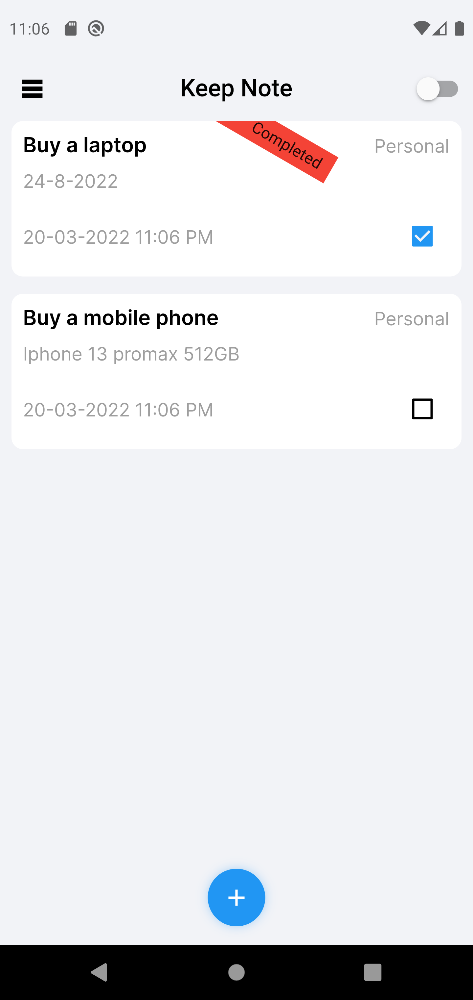
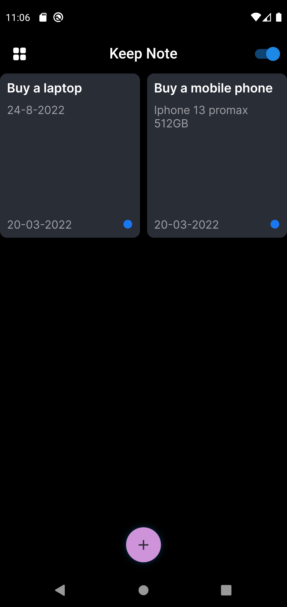
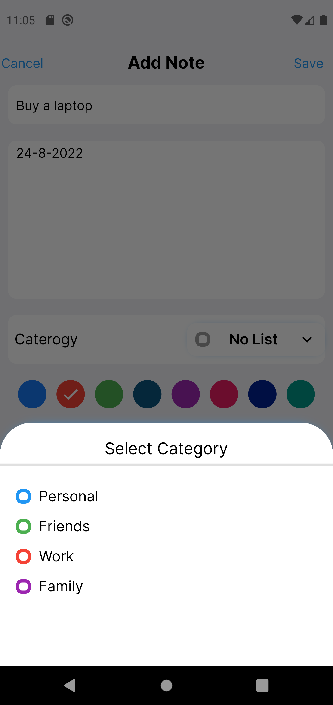

# KEEP NOTES - FLUTTER

# FEATURE APP
<ul>
    <li>Add Note</li>
    <li>Dark mode</li>
</ul>

## Hive NoSql - Flutter Bloc 

___

## Screenshot

<table border>
    <tr>
        <td></td>
        <td></td>
    <tr>
</table>
<table border>
    <tr>
        <td></td>
        <td></td>
    <tr>
</table> 
